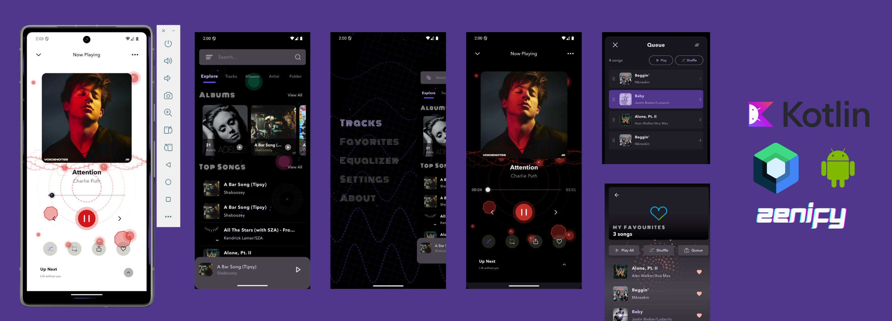

# Zenify



Zenify is a modern Android **music player** built with **Kotlin**, **Jetpack Compose**, and Android's latest **architecture components**. It delivers a clean, reactive, and persistent playback experience — from browsing local audio to managing playlists, favorites, and queues.

---

## ✨ Features

- **Local Audio Playback** – Browse and play songs stored on the device
- **Playlist Management** – Create, edit, and manage multiple playlists
- **Favorites** – Quickly mark and access favorite tracks
- **Queue Controls** – Add/remove songs and reorder the playback queue
- **Persistent State** – Remembers last played track and playback position
- **Mini Player** – With play/pause, next, previous, shuffle, and repeat controls
- **Error Handling** – Clear user feedback for playback errors
- **Modern UI** – Fully built using Jetpack Compose with smooth animations

---

## 🛠 Tech Stack

- **Kotlin**
- **Jetpack Compose**
- **Android Architecture Components** (ViewModel, StateFlow, SavedStateHandle)
- **Media3** (modern Android audio playback library)
- **DataStore** (persistent state management)
- **Koin** (dependency injection)
- **Coroutines** (asynchronous programming)

---

## 📂 Project Structure

```
app/
 └── src/main/java/com/faysal/zenify/
     ├── ui/                # UI screens and composables
     │    └── viewModels/   # ViewModels for state management
     ├── data/
     │    ├── datastore/    # DataStore managers
     │    └── service/      # Music service and connections
     └── domain/            # Use cases and repositories
```

---

## 🚀 Getting Started

### 1. Clone the Repository
```bash
git clone https://github.com/<your-username>/Zenify.git
```

### 2. Open in Android Studio
Open the project in **Android Studio 2023.1.1** (or newer).

### 3. Build the Project
Allow Gradle to sync and build dependencies.

### 4. Run the App
Connect an Android device or launch an emulator, then click **Run**.

---

## 🧩 Dependency Injection

Zenify uses **Koin** for dependency injection. Ensure you have the following module setup:

```kotlin
single { com.faysal.zenify.data.datastore.PlaylistDataStore(androidContext()) }
```

Other core dependencies (ViewModels, DataStore, Service Connection) are provided in `AppModule.kt`.

---

## 🤝 Contributing

Contributions are **welcome and encouraged!**  
Here’s how you can help:

- **Report Bugs** – Open an [issue](../../issues) describing the problem.
- **Suggest Features** – Share ideas to improve Zenify.
- **Submit Pull Requests** – Fork the repo, make your changes, and open a PR.

Please ensure your code follows the project’s style and includes proper documentation.

---

## 📸 Screenshots

_(Add screenshots or previews of your app UI here for better presentation)_

---

